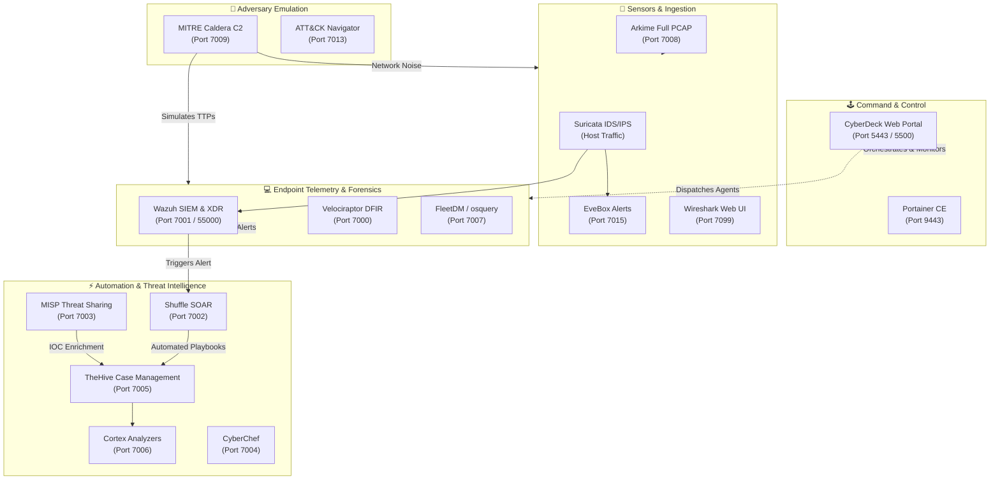

# 🛡️ SOC-CyberDeck: Unified Blue Team Cyber Range & Command Portal

[](https://www.docker.com/)
[](https://docs.docker.com/compose/)
[](https://ubuntu.com/)
[](https://opensource.org/licenses/MIT)
[](https://attack.mitre.org/)

> **⚠️ EDUCATIONAL & TRAINING ENVIRONMENT ONLY**  
> *SOC-CyberDeck is an isolated containerized cyber range designed for detection engineering, threat hunting, DFIR, and adversary emulation. It contains pre-configured credentials and is not intended for direct internet-exposed production environments.*

---

## 🧭 Executive Overview

**SOC-CyberDeck** is a turnkey, containerized Security Operations Center (SOC) cyber range and central command console. It bundles **15+ industry-standard enterprise security tools** into a single orchestrated Docker environment, coupled with a custom **Python/Flask Web Management Portal** that serves as a single pane of glass for real-time telemetry, container health monitoring, and automated agent deployment.

Whether you are simulating adversary behavior with **Caldera**, capturing and indexing full network PCAPs with **Arkime**, hunting on endpoints with **Velociraptor** and **FleetDM**, or automating alert response with **TheHive** and **Shuffle SOAR**, SOC-CyberDeck delivers an end-to-end tactical operations platform ready in minutes.

---

## 🏗️ Architecture & Data Flow



---

## 🎛️ The SOC-CyberDeck Portal

The platform features an integrated administrative web console built with Flask, providing:

* **Live Container Telemetry**: Automatic status tracking, container health, CPU/memory stats, and socket-level restart triggers.
* **Agent Deployment Center**: Instant, dynamically generated one-line installers and binaries for **Wazuh Agents**, **FleetDM/osquery**, **Velociraptor Agents**, and **Caldera Sandcat Agents** pre-bound to the host IP.
* **Audit & Changelog Stream**: Persistent event tracking for all system activities, container states, and configuration adjustments.
* **Built-in SSL/TLS Automation**: Self-signed certificate generator ensuring encrypted HTTPS communications out-of-the-box.

---

## 🔌 Integrated Tools Matrix

| Tool | Port | Protocol | Default Credentials | Category | Role in Lab |
| :--- | :---: | :---: | :--- | :--- | :--- |
| **CyberDeck Portal** | `5443` / `5500` | HTTPS / HTTP | `admin` / `cyberdeck123` | Management | Unified SOC operations dashboard |
| **Velociraptor** | `7000` | HTTPS | `admin` / `cyberdeck` | DFIR | Real-time endpoint forensics & artifact collection |
| **Wazuh Dashboard** | `7001` | HTTPS | `admin` / `SecretPassword` | SIEM / XDR | Centralized host log correlation & compliance |
| **Shuffle SOAR** | `7002` | HTTPS | First-time setup | SOAR | Open-source security orchestration & playbooks |
| **MISP** | `7003` | HTTPS | `admin@admin.test` / `admin` | CTI | Threat intelligence & IOC indicator exchange |
| **CyberChef** | `7004` | HTTP | None | Utility | Cyber Swiss Army Knife for data transformation |
| **TheHive** | `7005` | HTTP | `admin@thehive.local` / `secret` | SIRP | Security incident response & case management |
| **Cortex** | `7006` | HTTP | `admin` / `cyberdeck123` | Automation | Observable analysis and active response engines |
| **FleetDM** | `7007` | HTTP | Configured on first run | Endpoint | Fleet-wide osquery telemetry & compliance |
| **Arkime** | `7008` | HTTP | `admin` / `admin` | PCAP / NSM | Full packet capture, SPI search & session indexing |
| **Caldera C2** | `7009` | HTTP | `admin` / `cyberdeck` | Adversary | Automated MITRE ATT&CK adversary emulation |
| **Wireshark Web** | `7099` | HTTPS | `admin` / `cyberdeck` | Network | Browser-based interactive deep packet analysis |
| **MITRE Navigator** | `7013` | HTTP | None | CTI / Mapping | Visual ATT&CK matrix technique coverage map |
| **EveBox** | `7015` | HTTP | None | Network IDS | Real-time Suricata event viewer and alert triage |
| **Portainer CE** | `9443` | HTTPS | Configured on first run | DevOps | Container runtime management and volume explorer |

---

## ⚡ Quick Start

### 1. Prerequisites
* **Operating System**: Ubuntu 22.04 or 24.04 LTS (x86_64) recommended
* **Hardware**:
  * Minimum: 4 vCPUs, 16 GB RAM, 60 GB SSD
  * Recommended: 8 vCPUs, 32 GB RAM, 100 GB SSD
* **Network**: Promiscuous mode enabled if deploying in VMware/VirtualBox to allow Suricata and Arkime to sniff host traffic.

### 2. Automated Deployment (One-Click)

Clone the repository and run the automated installation script:

```bash
git clone https://github.com/sandeepmothukuri/SOC-CyberDeck.git
cd SOC-CyberDeck

# Make installer executable
chmod +x cyberdeck_install.sh

# Run the turnkey deployment (handles Docker, dependencies, SSL, and stack launch)
./cyberdeck_install.sh
```

### 3. Verification & Access

Once deployment completes:
1. Open your browser and navigate to the CyberDeck Portal:
   ```text
   https://<HOST_IP>:5443
   ```
2. Log in using `admin` / `cyberdeck123`.
3. Use the dashboard to monitor tool startup health and access all operational security consoles.

---

## 🎯 Threat Hunting & Detection Capabilities

### Full Packet Inspection (Arkime & Suricata)
Capture live interface traffic or inject sample PCAPs into the indexed OpenSearch pipeline:
```bash
# Capture 2 minutes of live network traffic and index into Arkime
./fix-arkime.sh -t 2min

# Generate continuous background PCAPs
./generate-pcap-for-arkime.sh --background -d 10min
```

### Sigma & YARA Rule Validation
Pre-bundled rules located in `/opt/sigma-rules` and `/opt/yara-rules`:
```bash
# Scan a suspicious artifact using the built-in YARA repository
yara -r /opt/yara-rules/index.yar /path/to/suspicious/payload

# Convert Sigma rules to OpenSearch / Lucene queries
sigma convert -t opensearch_lucene -p ecs rule.yml
```

### Adversary Emulation with Caldera
1. Navigate to Caldera at `http://<HOST_IP>:7009`.
2. Deploy a `sandcat` agent to test endpoints using the automated command from the **CyberDeck Portal**.
3. Select pre-built adversary profiles (e.g. *Discovery*, *Privilege Escalation*, or *Ransomware simulation*) and run controlled operations against your lab targets.

---

## 🛠️ Maintenance & CLI Utilities

| Script | Purpose |
| :--- | :--- |
| [`./cyberdeck_install.sh`](file:///cyberdeck_install.sh) | Turnkey installer for prerequisites, Docker, SSL, and all 15 services |
| [`./force-start.sh`](file:///force-start.sh) | Gracefully cleans Docker socket state and restarts the complete stack |
| [`./verify-post-reboot.sh`](file:///verify-post-reboot.sh) | Post-boot diagnostic suite checking systemd, Docker, and listening ports |
| [`./fix-docker-external-access.sh`](file:///fix-docker-external-access.sh) | Re-applies iptables forwarding rules for external VM network access |
| [`./fix-fleet.sh`](file:///fix-fleet.sh) | Restores Fleet server connection and re-generates osquery enroll secrets |
| [`./update-network-interface.sh`](file:///update-network-interface.sh) | Re-binds Suricata & Arkime sniffing listeners when host interface changes |

---

## 🤝 Contributing

Contributions, feedback, and custom Shuffle playbooks are welcome!
1. Fork the Project
2. Create your Feature Branch (`git checkout -b feature/AmazingFeature`)
3. Commit your Changes (`git commit -m 'Add some AmazingFeature'`)
4. Push to the Branch (`git push origin feature/AmazingFeature`)
5. Open a Pull Request

---

## 📄 License

Distributed under the MIT License. See [LICENSE](file:///LICENSE) for more information.
