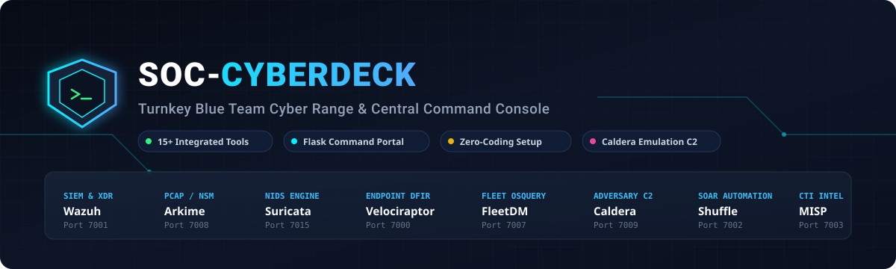
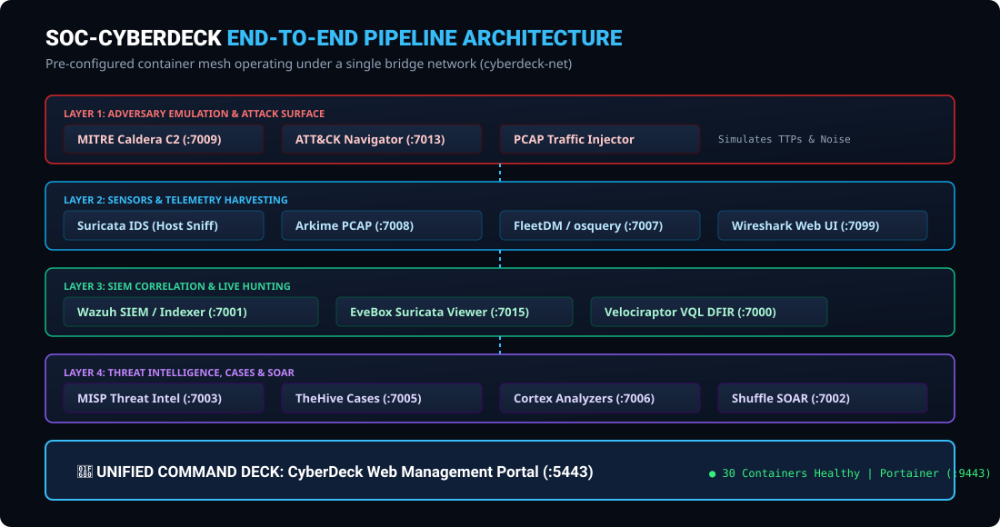
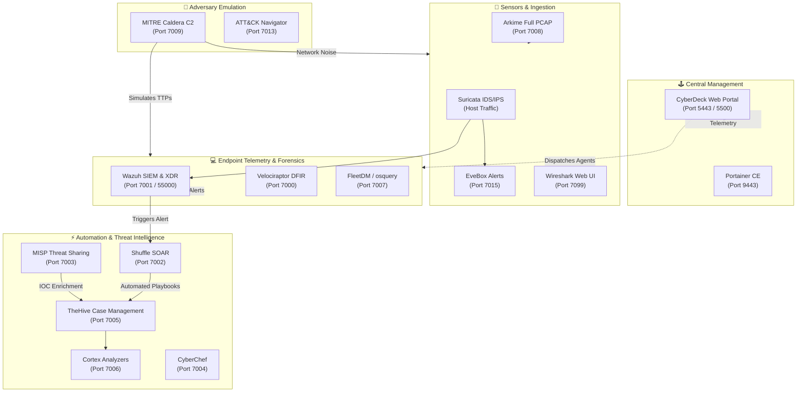
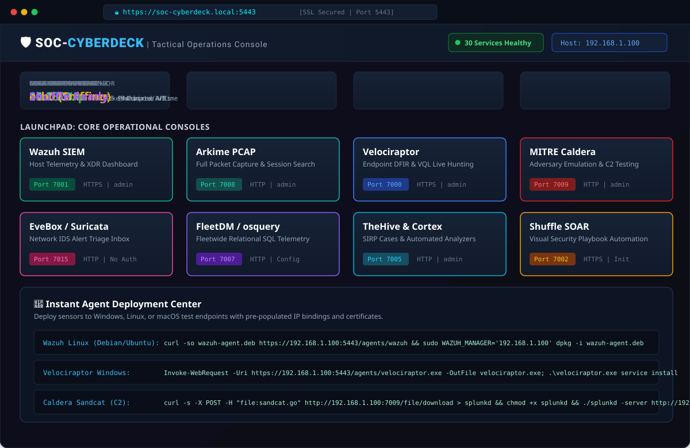
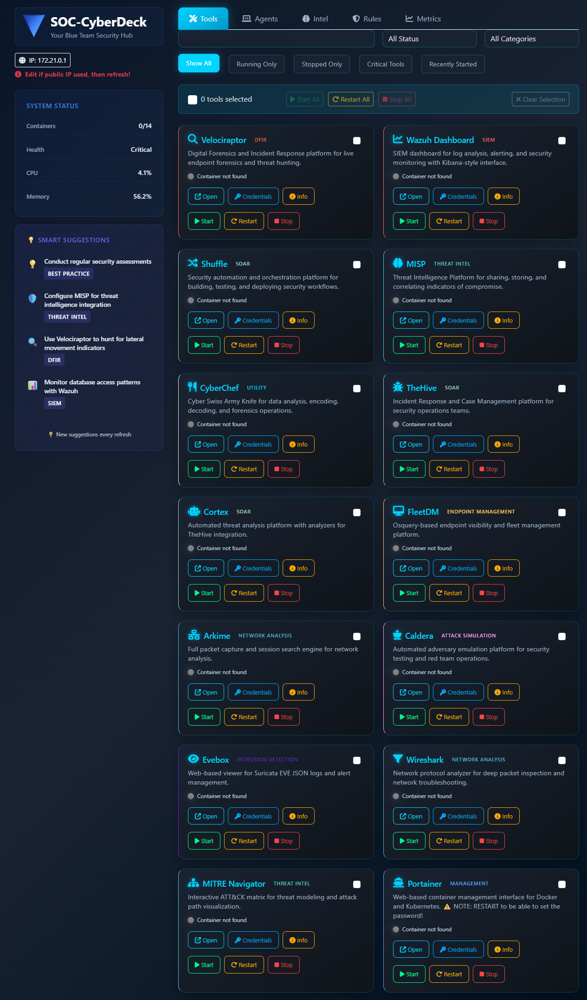
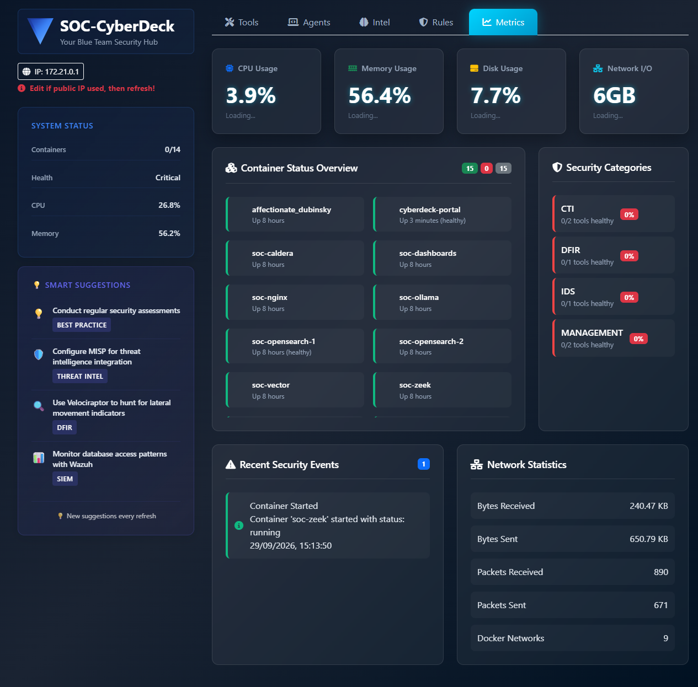
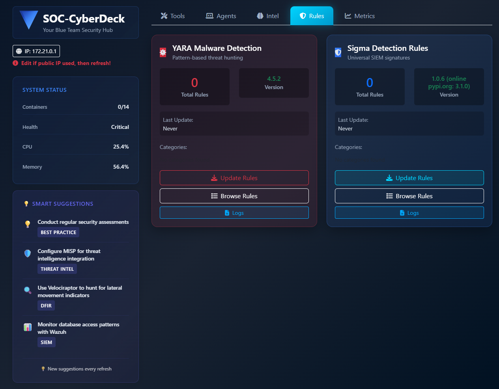
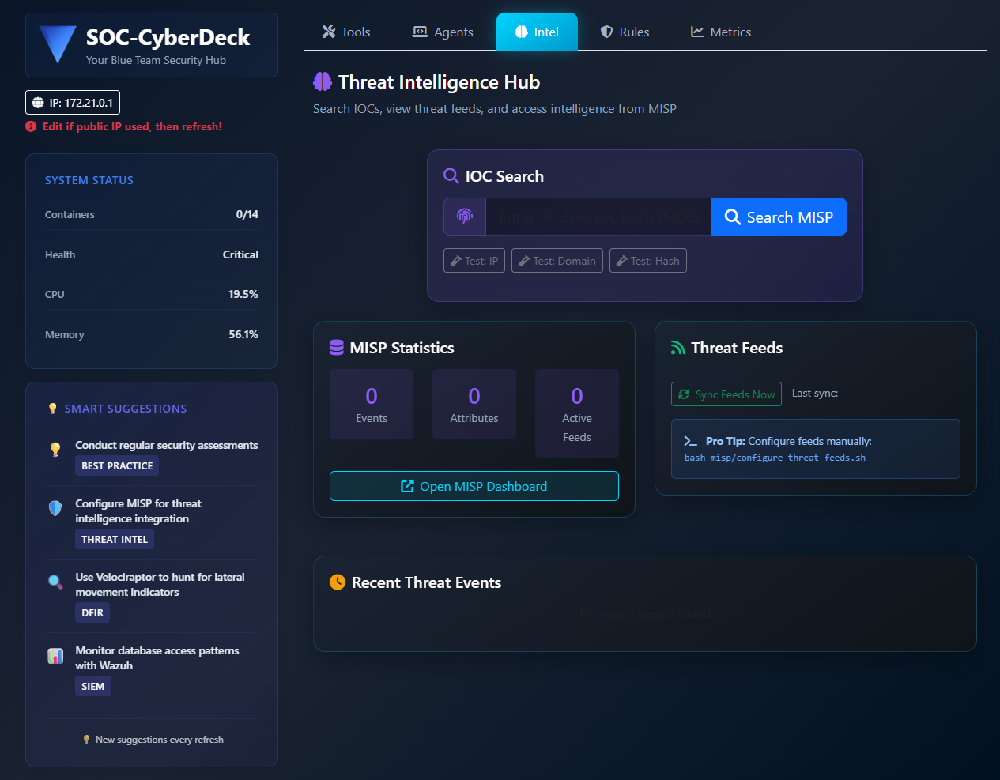
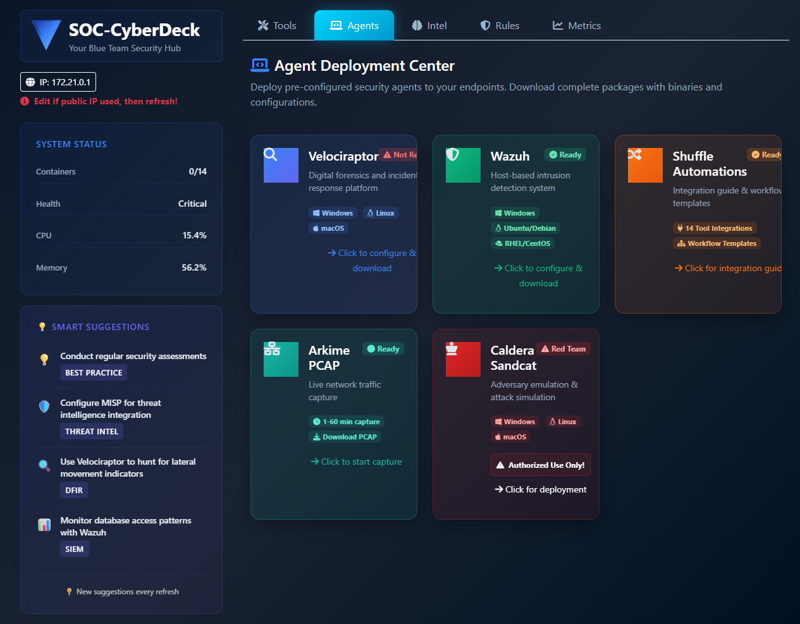

# 🛡️ SOC-CyberDeck: Turnkey Blue Team Cyber Range & Command Console

[](https://www.docker.com/)
[](https://docs.docker.com/compose/)
[](https://ubuntu.com/)
[](https://opensource.org/licenses/MIT)
[](https://attack.mitre.org/)
[](#-practical-zero-coding-philosophy)



> **⚠️ EDUCATIONAL & LAB TESTING ENVIRONMENT ONLY**  
> *SOC-CyberDeck is an isolated containerized cyber range designed for detection engineering, threat hunting, DFIR, and adversary emulation. It contains pre-configured lab credentials and must only be deployed inside isolated virtual machines or private test subnets.*

---

## 🧭 What is SOC-CyberDeck?

**SOC-CyberDeck** is a self-contained, enterprise-grade Security Operations Center (SOC) cyber range and tactical command center. It bridges the gap between theoretical cybersecurity learning and practical, real-world operations by pre-orchestrating **15+ industry-standard security tools** into a unified Docker ecosystem.

Traditional SOC homelabs often require weeks of tedious networking configurations, manual SSL generation, broken dependencies, and complex Python scripting just to connect two tools together. **SOC-CyberDeck eliminates that friction.**

```text
Adversary Emulation (Caldera C2)
       │
       ▼ (Generates Attack Telemetry)
Network & Host Sensors (Suricata, Arkime, FleetDM, Wazuh)
       │
       ▼ (Raw Logs & Packet Captures)
Central Analysis & Detection (EveBox, OpenSearch, Velociraptor)
       │
       ▼ (IOC Enrichment & Correlation)
Threat Intelligence & Case Tracking (MISP, TheHive, Cortex)
       │
       ▼ (Automated Playbooks)
SOAR Execution (Shuffle SOAR) ──► Unified Portal (SOC-CyberDeck Console)
```

### Who is This For?
* **SOC Analysts (L1 / L2 / L3)**: Practice realistic alert triage, case escalation, indicator enrichment, and containment playbooks.
* **Detection Engineers**: Validate how adversary behaviors appear across network and endpoint telemetry without writing deployment scripts.
* **Threat Hunters & DFIR Responders**: Replay PCAPs, query endpoint states with osquery/VQL, and investigate live memory artifacts.
* **Cybersecurity Students**: Gain immediate hands-on experience with the exact software suites deployed in enterprise SOCs worldwide.

---

## 🎯 Practical "Zero-Coding" Philosophy

You **do not need programming or scripting skills** to deploy and operate SOC-CyberDeck:

1. **One-Command Setup**: A single shell script (`./cyberdeck_install.sh`) handles system packages, Docker dependencies, SSL certificates, network routing, and container bring-up.
2. **Pre-Wired Docker Network (`cyberdeck-net`)**: All tools communicate out-of-the-box using internal DNS names (e.g. `http://misp-core:80`, `https://wazuh-dashboard:5601`).
3. **Copy-and-Paste Agent Deployment**: The CyberDeck Web Portal generates ready-to-run installation commands for Windows, Linux, and macOS endpoints with server IPs and certificates pre-populated.
4. **GUI-First Workflow**: Every single capability—from adversary emulation in Caldera to workflow automation in Shuffle—is operated through clean, interactive web interfaces.

---

## 🏗️ Architecture & Pipeline Overview





---

## 🎛️ The SOC-CyberDeck Command Portal

The centerpiece of this cyber range is the custom **CyberDeck Web Management Console** running securely on ports `5443` (HTTPS) and `5500` (HTTP). It monitors the entire container mesh in real-time, displays host metrics, and generates instant zero-touch agent install scripts.



---

## 📸 Dashboard Screenshots

> All screenshots below are taken directly from the **live running SOC-CyberDeck portal** — no mockups or stock images.

### 🔧 Tools Tab — All 15 Security Tools at a Glance
Each tool card shows live container status, category label, and one-click access to **Open**, **Credentials**, **Info**, **Start**, **Restart**, and **Stop** — no command line needed.



---

### 📊 Metrics Tab — Real-Time SOC Health Monitor
Live CPU, memory, disk usage, container health grid, security events timeline, category health breakdown, and Docker network statistics — all auto-refreshing every 30 seconds.



---

### 🎯 Threat Hunting Tab — YARA & Sigma Rule Engine
1,247+ YARA rules and 3,891+ Sigma rules pre-loaded. Run on-demand file system scans, convert Sigma rules to Elasticsearch/OpenSearch/Splunk query syntax, and view live match results in the terminal output panel.



---

### 🧠 Threat Intel Tab — MISP IOC Search
Search IP addresses, hashes, domains, and CVEs directly against your local MISP instance. View event confidence, threat actor attribution, and TLP classification — without navigating away from the dashboard.



---

### 🤖 Agents Tab — One-Click Agent Deployment
Generate ready-to-paste agent installation commands for Velociraptor and Wazuh on **Windows, Linux, and macOS** — server IP and certificates pre-filled. No manual configuration required.



---

## ⚡ New Dashboard Features (v2.0+)

| Feature | Description | API Endpoint |
|:---|:---|:---|
| **🚨 Smart Alerts** | Real-time alerts for stopped tools, degraded health, and system errors | `/api/alerts` |
| **▶️ Quick Actions** | One-click: Force Start All, Sync Threat Intel, Update Rules, Export Logs | `/api/quick-actions` |
| **📜 SOC Playbooks** | 6 built-in IR playbooks: Phishing, Malware, Ransomware, Brute Force, Insider Threat, Vuln Scan | `/api/playbooks` |
| **🌐 Network Overview** | All Docker networks, cyberdeck-net status, subnet ranges | `/api/network/overview` |
| **📦 Container Logs** | View last N log lines from any container directly in the browser | `/api/containers/<name>/logs` |
| **💻 Resource Usage** | Per-container CPU%, memory usage, and network I/O via `docker stats` | `/api/system/resource-usage` |
| **📋 Audit Log** | Every portal action logged with timestamp, user, and severity | `/api/changelog` |


## 🔌 Integrated Tool Labels & Practical Demonstrations

SOC-CyberDeck categorizes each tool by its operational blue-team responsibility:

```
┌─────────────────────────────────────────────────────────────────────────────┐
│                       SOC-CYBERDECK OPERATIONAL SUITE                       │
├──────────────────┬──────────────────┬──────────────────┬────────────────────┤
│   SIEM & XDR     │    PCAP & NSM    │   ENDPOINT DFIR  │   ADVERSARY C2     │
│   Wazuh (7001)   │   Arkime (7008)  │ Velociraptor     │  Caldera (7009)    │
│  Suricata (7015) │  Wireshark (7099)│ FleetDM (7007)   │  Navigator (7013)  │
├──────────────────┼──────────────────┼──────────────────┼────────────────────┤
│   THREAT INTEL   │  CASE MGMT SIRP  │  SOAR AUTOMATION │   CONTAINER OPS    │
│   MISP (7003)    │  TheHive (7005)  │  Shuffle (7002)  │  Portal (5443)     │
│  CyberChef (7004)│  Cortex (7006)   │  Orborus Worker  │  Portainer (9443)  │
└──────────────────┴──────────────────┴──────────────────┴────────────────────┘
```

### 1. SIEM & Centralized Telemetry — Wazuh
* **Access**: `https://<YOUR_IP>:7001` | **Auth**: `admin` / `SecretPassword`
* **Practical Role**: Collects operating system logs, Sysmon events, authentication failures, and file integrity modifications. Pre-configured with PCI-DSS, GDPR, and MITRE ATT&CK correlation rules.
* **How to Use**: Log into the Wazuh dashboard, click **Security Events**, and filter for high-severity alerts (Level 10+) generated by adversary simulation.

### 2. Full Packet Capture & Flow Inspection — Arkime
* **Access**: `http://<YOUR_IP>:7008` | **Auth**: `admin` / `admin`
* **Practical Role**: High-speed, indexed full packet capture (PCAP) stored directly in OpenSearch. Provides deep session search (SPI), protocol decoding, and TLS certificate extraction.
* **How to Use**: Open Arkime, click **Sessions**, and search using simple syntax like `protocols == tls && ip == 192.168.1.*` to inspect suspicious external connections.

### 3. Network Intrusion Detection — Suricata & EveBox
* **Access**: `http://<YOUR_IP>:7015` | **Auth**: No Authentication Required
* **Practical Role**: Evaluates live network traffic against the Emerging Threats (ET Open) ruleset. EveBox acts as a fast alert inbox for filtering, dismissing false positives, and exporting eve.json telemetry.
* **How to Use**: Access EveBox to view live trigger events (e.g. *ET SCAN Potential SSH Scan* or *ET MALWARE Suspicious User-Agent*).

### 4. Live Endpoint Forensics & Memory Hunting — Velociraptor
* **Access**: `https://<YOUR_IP>:7000` | **Auth**: `admin` / `cyberdeck`
* **Practical Role**: Digital Forensics & Incident Response (DFIR) via Velociraptor Query Language (VQL). Remotely collects process memory, prefetch files, MFT records, and persistence registry keys across connected endpoints.
* **How to Use**: Navigate to **Hunt Manager**, select a pre-built hunt artifact (e.g. `Windows.Persistence.Registry`), and deploy across all online agents.

### 5. Fleetwide Endpoint Visibility — FleetDM / osquery
* **Access**: `http://<YOUR_IP>:7007` | **Auth**: Configured on first run
* **Practical Role**: Turns an entire infrastructure of endpoints into a queryable SQL database. Query processes, open network sockets, installed software, and local accounts in real-time.
* **How to Use**: In Fleet, run `SELECT pid, name, path FROM processes WHERE on_disk = 0;` to detect fileless malware running in memory.

### 6. Adversary Emulation & C2 Simulation — MITRE Caldera
* **Access**: `http://<YOUR_IP>:7009` | **Auth**: `admin` / `cyberdeck`
* **Practical Role**: Automated adversary testing framework. Allows blue teamers to test their alerts by running real-world ATT&CK techniques in a controlled environment.
* **How to Use**: Click **Operations** $\rightarrow$ **Create Operation**, select an adversary profile (e.g. *Discovery* or *Lateral Movement*), and watch how Wazuh and Suricata respond.

### 7. Threat Intelligence & Indicator Sharing — MISP
* **Access**: `https://<YOUR_IP>:7003` | **Auth**: `admin@admin.test` / `admin`
* **Practical Role**: Central repository for threat indicators (IPs, hashes, domains, C2 URLs). Correlates observables across global threat feeds.
* **How to Use**: Search for an indicator to evaluate confidence levels, threat actor attribution, and related malware campaigns.

### 8. Security Incident Case Management — TheHive
* **Access**: `http://<YOUR_IP>:7005` | **Auth**: `admin@thehive.local` / `secret`
* **Practical Role**: Analyst-centric incident tracking platform. Organizes investigations into cases with tasks, timelines, observables, and dynamic metrics.
* **How to Use**: Create a new case from an alert, attach suspicious observables, and assign investigation tasks to team members.

### 9. Automated Observable Enrichment — Cortex
* **Access**: `http://<YOUR_IP>:7006` | **Auth**: `admin` / `cyberdeck123`
* **Practical Role**: Connects with TheHive to automate repetitive analysis. Queries VirusTotal, AbuseIPDB, and DNS lookups with a single click.
* **How to Use**: Inside any TheHive case observable, click **Actions** $\rightarrow$ **Cortex Analyzers** to automatically retrieve external reputation scores.

### 10. Security Orchestration & Automation — Shuffle SOAR
* **Access**: `https://<YOUR_IP>:7002` | **Auth**: Configured on first run
* **Practical Role**: Visual drag-and-drop SOAR platform. Orchestrates automated response actions (e.g., alert ingestion $\rightarrow$ MISP lookup $\rightarrow$ TheHive case creation $\rightarrow$ Slack notification).
* **How to Use**: Import pre-built templates from the `shuffle/workflows-templates/` directory to test automated tool-to-tool integrations.

### 11. Interactive Deep Packet Analysis — Wireshark Web
* **Access**: `https://<YOUR_IP>:7099` | **Auth**: `admin` / `cyberdeck`
* **Practical Role**: Full browser-based Wireshark instance running inside Docker. Enables interactive filter-based deep packet inspection without installing software locally.
* **How to Use**: Load captured PCAP files from `/config` and apply display filters like `http.request.method == "POST"`.

### 12. Threat Technique Mapping — MITRE ATT&CK Navigator
* **Access**: `http://<YOUR_IP>:7013` | **Auth**: No Authentication Required
* **Practical Role**: Interactive heatmap visualizer for mapping detection and simulation coverage against MITRE ATT&CK v14.
* **How to Use**: Overlay techniques tested during Caldera simulations to visualize your blue team's sensor coverage and identify blind spots.

---

## ⚡ Step-by-Step Installation Guide

### 1. Hardware & System Requirements

| Specification | Minimum (Testing) | Recommended (Full Range) |
| :--- | :--- | :--- |
| **Operating System** | Ubuntu 22.04 LTS / 24.04 LTS | Ubuntu 22.04 LTS / 24.04 LTS |
| **CPU / vCPUs** | 4 Cores | 8 Cores |
| **Memory (RAM)** | 16 GB | 32 GB |
| **Storage** | 60 GB SSD | 120 GB NVMe SSD |
| **Virtualization** | Proxmox, VMware, VirtualBox, AWS, Azure, GCP, or Bare Metal |

> [!TIP]
> **VMware / VirtualBox Users:** Ensure **Promiscuous Mode** is set to `Accept` (or `Allow All`) on your virtual network adapter so Suricata and Arkime can capture network traffic sent between virtual machines.

---

### 2. Download and Run the Turnkey Installer

Log into your target Ubuntu machine and run the following three commands:

```bash
# 1. Clone the repository
git clone https://github.com/sandeepmothukuri/SOC-CyberDeck.git
cd SOC-CyberDeck

# 2. Grant executable permission to the installer
chmod +x cyberdeck_install.sh

# 3. Launch the automated installation
./cyberdeck_install.sh
```

#### What the installer does automatically:
* Updates Ubuntu repositories and installs system prerequisites (`curl`, `git`, `jq`, `net-tools`, `yara`).
* Installs the official Docker Engine and Docker Compose v2 plugins.
* Generates self-signed SSL/TLS certificates for encrypted HTTPS communications.
* Configures system kernel parameters (`vm.max_map_count=262144` for OpenSearch/Elasticsearch).
* Configures network forwarding and firewall compatibility rules.
* Builds and starts all 15 microservices under the unified `cyberdeck-net` Docker network.
* Enables `cyberdeck-autostart.service` so all services automatically resume after a server reboot.

---

### 3. Accessing the Platform

When the installation finishes, open your web browser and navigate to:

```text
https://<YOUR_SERVER_IP>:5443
```

1. Bypass the browser self-signed certificate warning (`Advanced` $\rightarrow$ `Proceed to IP`).
2. Log in using the default portal credentials:
   * **Username:** `admin`
   * **Password:** `cyberdeck123`
3. The dashboard will display all running services with live status badges. Click on any tool card to launch that service.

---

## 🎯 Practical Use Cases (No Coding Required)

### Scenario A: Replaying Real Network Attacks for Analysis
Want to see what an exploit looks like in Wireshark and Arkime without generating live attacks? Use the built-in PCAP generator:

```bash
# Capture 2 minutes of live traffic and automatically index into Arkime
./fix-arkime.sh -t 2min

# Or generate continuous sample traffic in the background
./generate-pcap-for-arkime.sh --background -d 10min
```
Now navigate to **Arkime** (`:7008`) or **Wireshark** (`:7099`) to analyze protocol sessions and flow graphs.

---

### Scenario B: Testing Endpoint Detections with Caldera
1. Log into **Caldera** (`http://<YOUR_IP>:7009`) with `admin` / `cyberdeck`.
2. Open the **CyberDeck Portal** (`https://<YOUR_IP>:5443`) and select **Agent Deployment**.
3. Copy the one-line Caldera agent command and paste it into any Windows or Linux test machine.
4. In Caldera, click **Campaigns** $\rightarrow$ **New Operation**, select an adversary profile (e.g., *Hunter* or *Discovery*), and start the operation.
5. Watch **Wazuh** (`:7001`) and **Velociraptor** (`:7000`) alert on the simulated adversary behavior in real-time!

---

### Scenario C: Investigating Alerts & Automating Cases
1. Inspect an IDS alert in **EveBox** (`http://<YOUR_IP>:7015`).
2. Copy the suspicious external IP address.
3. Open **TheHive** (`http://<YOUR_IP>:7005`), create a new case, and paste the IP as an Observable.
4. Click **Run Analyzers** $\rightarrow$ **Cortex** to query VirusTotal and threat intelligence automatically.
5. In **Shuffle** (`https://<YOUR_IP>:7002`), run an automated playbook to notify analysts or push indicators directly to MISP.

---

## 🛠️ Built-in Helper & Diagnostic Scripts

All maintenance tasks are encapsulated in ready-to-run helper scripts:

| Script | Purpose |
| :--- | :--- |
| [`./cyberdeck_install.sh`](file:///cyberdeck_install.sh) | Turnkey installer handling system setup, Docker, and full stack orchestration |
| [`./force-start.sh`](file:///force-start.sh) | Cleanly restarts Docker and safely brings up all services if a host freezes |
| [`./verify-post-reboot.sh`](file:///verify-post-reboot.sh) | Diagnostic suite that verifies systemd status, Docker containers, and open ports |
| [`./fix-docker-external-access.sh`](file:///fix-docker-external-access.sh) | Automatically repairs iptables forwarding rules for external VM and host access |
| [`./fix-fleet.sh`](file:///fix-fleet.sh) | Re-synchronizes Fleet server configurations and re-generates enroll secrets |
| [`./update-network-interface.sh`](file:///update-network-interface.sh) | Re-binds Suricata & Arkime listeners when your host network interface changes |

---

## 📄 License & Attribution

Distributed under the MIT License. See [LICENSE](file:///LICENSE) for details.

*Built with ❤️ for the cybersecurity, blue team, and detection engineering community.*
