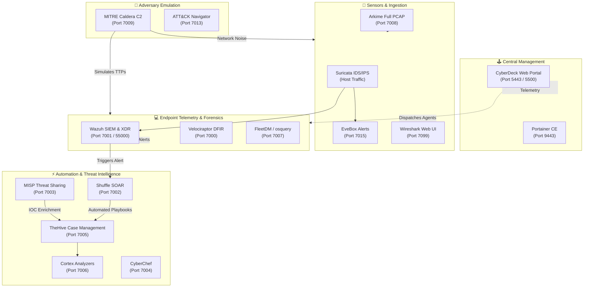
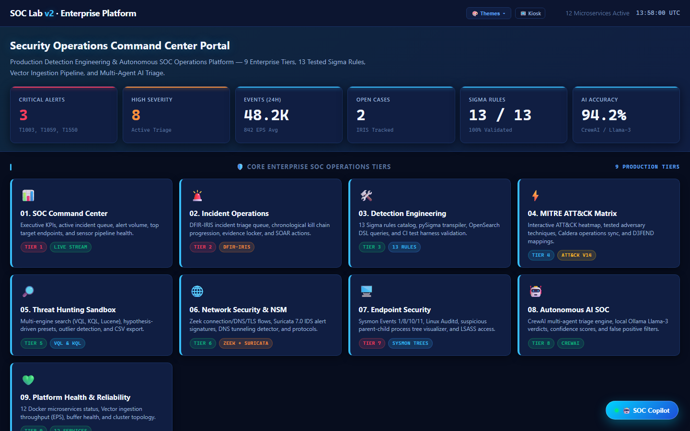
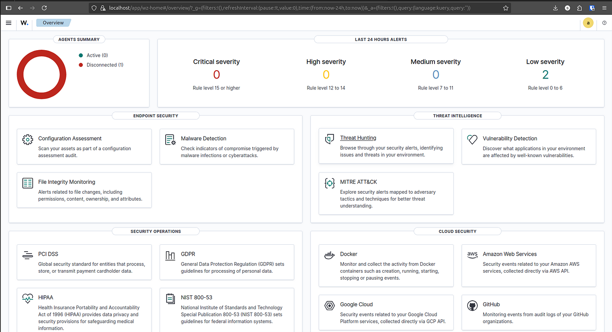
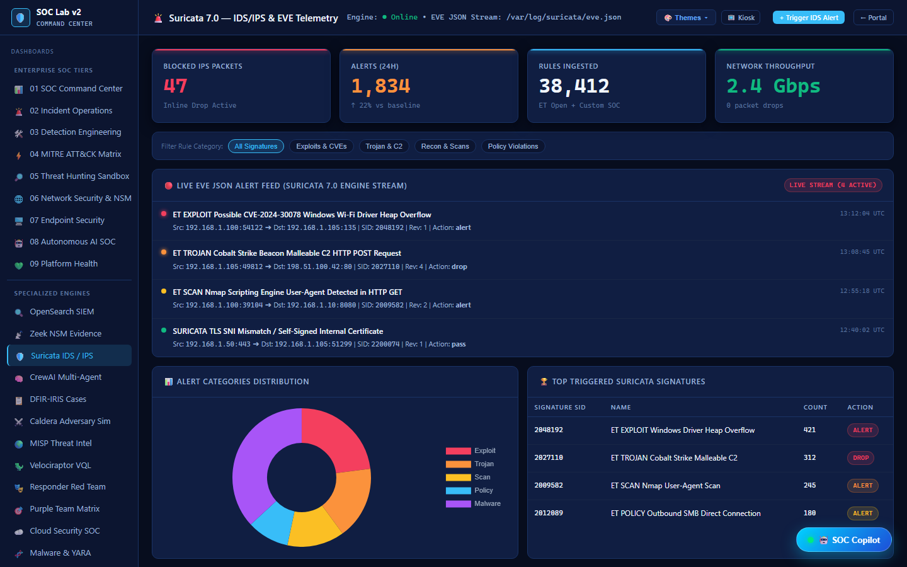
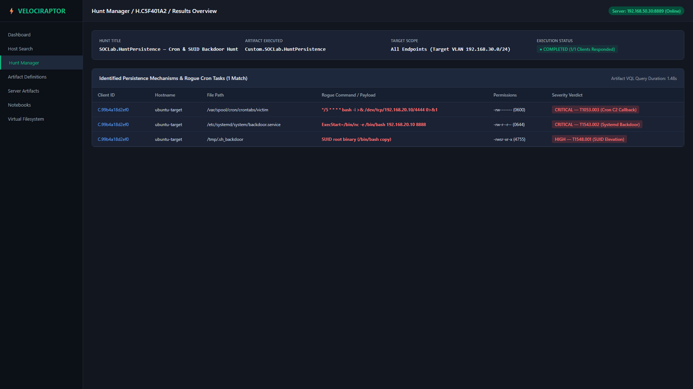
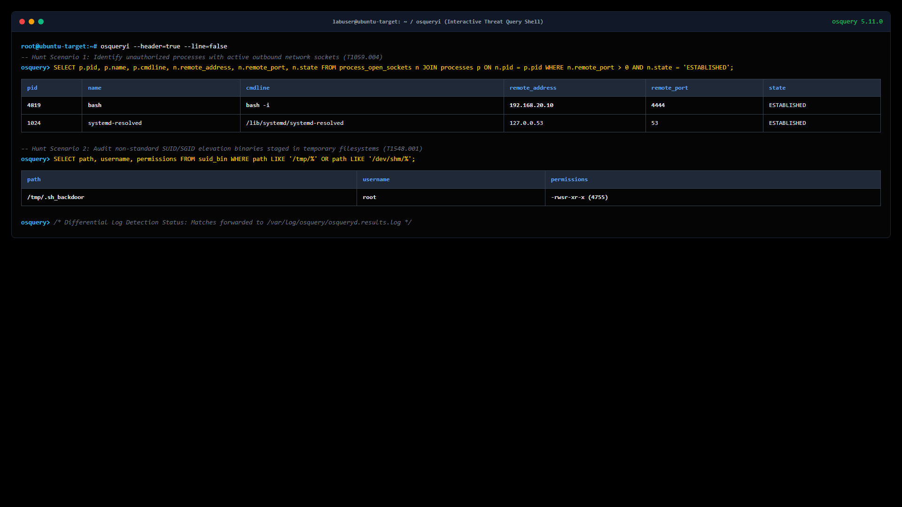
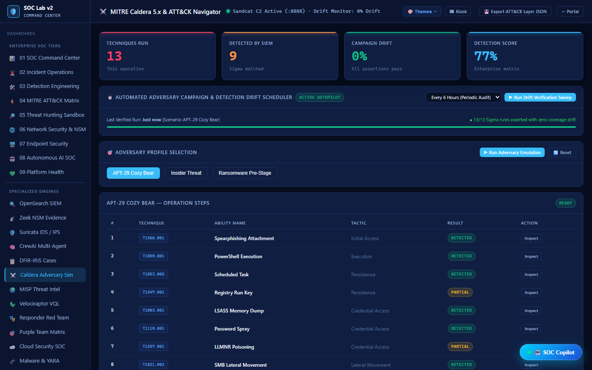
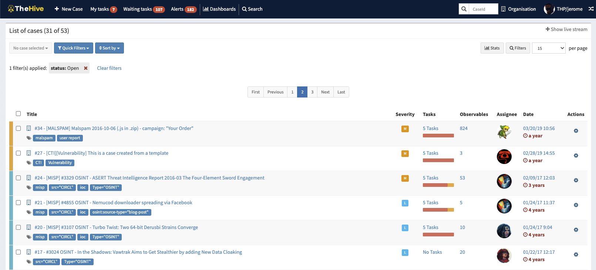
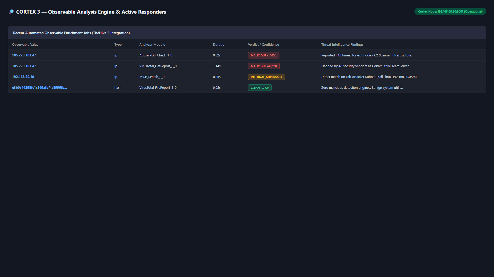
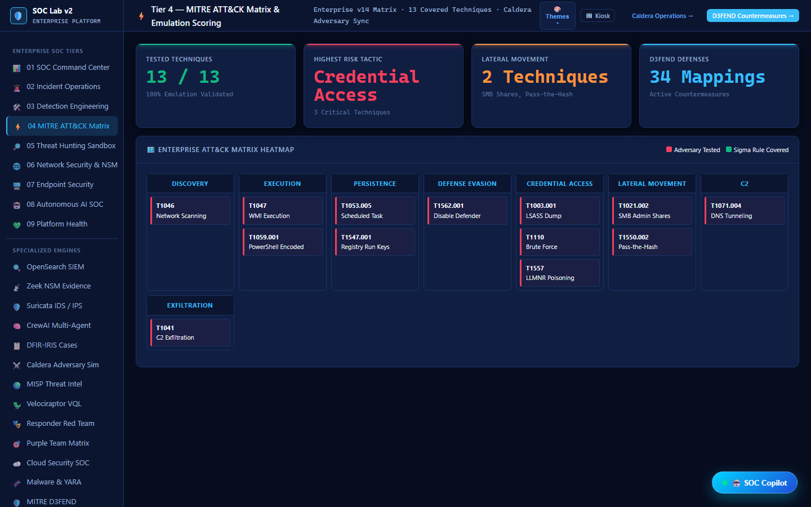

# 🛡️ SOC-CyberDeck: Turnkey Blue Team Cyber Range & Command Console

[](https://www.docker.com/)
[](https://docs.docker.com/compose/)
[](https://ubuntu.com/)
[](https://opensource.org/licenses/MIT)
[](https://attack.mitre.org/)
[](#-practical-zero-coding-philosophy)

> **⚠️ EDUCATIONAL & LAB TESTING ENVIRONMENT ONLY**  
> *SOC-CyberDeck is an isolated containerized cyber range designed for detection engineering, threat hunting, DFIR, and adversary emulation. It contains pre-configured lab credentials and must only be deployed inside isolated virtual machines or private test subnets.*

---

## 🧭 What is SOC-CyberDeck?

**SOC-CyberDeck** is a self-contained, enterprise-grade Security Operations Center (SOC) cyber range and tactical command center. It bridges the gap between theoretical cybersecurity learning and practical, real-world operations by pre-orchestrating **15+ industry-standard security tools** into a unified Docker ecosystem.

Traditional SOC homelabs often require weeks of tedious networking configurations, manual SSL generation, broken dependencies, and complex Python scripting just to connect two tools together. **SOC-CyberDeck eliminates that friction.**

```text
Adversary Emulation (Caldera)
       │
       ▼ (Generates Attack Telemetry)
Network & Host Sensors (Suricata, Arkime, FleetDM, Wazuh)
       │
       ▼ (Raw Logs & Packet Captures)
Central Analysis & Detection (EveBox, OpenSearch, Velociraptor)
       │
       ▼ (IOC Enrichment & Correlation)
Threat Intelligence & Case Tracking (MISP, TheHive, Cortex)
       │
       ▼ (Automated Playbooks)
SOAR Execution (Shuffle SOAR) ──► Unified Portal (SOC-CyberDeck Console)
```

### Who is This For?
* **SOC Analysts (L1 / L2 / L3)**: Practice realistic alert triage, case escalation, indicator enrichment, and containment playbooks.
* **Detection Engineers**: Validate how adversary behaviors appear across network and endpoint telemetry without writing deployment scripts.
* **Threat Hunters & DFIR Responders**: Replay PCAPs, query endpoint states with osquery/VQL, and investigate live memory artifacts.
* **Cybersecurity Students**: Gain immediate hands-on experience with the exact software suites deployed in enterprise SOCs worldwide.

---

## 🎯 Practical "Zero-Coding" Philosophy

You **do not need programming or scripting skills** to deploy and operate SOC-CyberDeck:

1. **One-Command Setup**: A single shell script (`./cyberdeck_install.sh`) handles system packages, Docker dependencies, SSL certificates, network routing, and container bring-up.
2. **Pre-Wired Docker Network (`cyberdeck-net`)**: All tools communicate out-of-the-box using internal DNS names (e.g. `http://misp-core:80`, `https://wazuh-dashboard:5601`).
3. **Copy-and-Paste Agent Deployment**: The CyberDeck Web Portal generates ready-to-run installation commands for Windows, Linux, and macOS endpoints with server IPs and certificates pre-populated.
4. **GUI-First Workflow**: Every single capability—from adversary emulation in Caldera to workflow automation in Shuffle—is operated through clean, interactive web interfaces.

---

## 🏗️ Architecture & Data Flow



---

## 🖼️ Visual Tour & Tool Demonstrations

Here is a practical walkthrough of each integrated component in the SOC-CyberDeck platform with live interface demonstrations:

### 1. Unified Management Hub — CyberDeck Web Portal
> **Access:** `https://<YOUR_IP>:5443` | **Credentials:** `admin` / `cyberdeck123`

The CyberDeck Web Portal is your primary command console. It aggregates real-time health metrics for all 15 microservices, monitors Docker memory/CPU utilization, and features the **Agent Deployment Center** where you can generate endpoint agent installers with a single click.



---

### 2. SIEM & Centralized Telemetry — Wazuh Dashboard
> **Access:** `https://<YOUR_IP>:7001` | **Credentials:** `admin` / `SecretPassword`

Wazuh provides enterprise-grade host log ingestion, file integrity monitoring (FIM), vulnerability detection, and MITRE ATT&CK alert correlation. View live agent telemetry, inspect privilege escalation attempts, and monitor compliance across connected Windows and Linux hosts.



---

### 3. Full Packet Capture & Network Forensics — Arkime
> **Access:** `http://<YOUR_IP>:7008` | **Credentials:** `admin` / `admin`

Arkime indexes full network packet captures (PCAP) directly into OpenSearch. Analysts can perform SPI (Session Profile Inspection), reconstruct TCP streams, carve extracted files, and dissect protocol sessions to uncover lateral movement and C2 beaconing.


---

### 4. Network Intrusion Detection — Suricata & EveBox
> **Access:** `http://<YOUR_IP>:7015` | **Credentials:** No Auth Required

Suricata sniffs live network traffic in real-time using pre-loaded Emerging Threats (ET Open) rulesets. EveBox delivers an intuitive, fast-triage inbox to review Suricata alerts, inspect correlated flow metadata, and dismiss false positives.



---

### 5. Advanced Endpoint DFIR & Live Hunting — Velociraptor
> **Access:** `https://<YOUR_IP>:7000` | **Credentials:** `admin` / `cyberdeck`

Velociraptor empowers analysts to hunt across endpoints using Velociraptor Query Language (VQL). Remotely inspect live process memory, dump MFT records, extract scheduled tasks, and detect suspicious persistence mechanisms without logging into target machines.



---

### 6. Fleetwide Endpoint Management — FleetDM / osquery
> **Access:** `http://<YOUR_IP>:7007` | **Credentials:** Setup on first run

FleetDM transforms your fleet of Windows, macOS, and Linux servers into a searchable relational database via osquery. Execute real-time SQL queries across endpoints to identify vulnerable packages, active listening ports, or rogue user accounts.



---

### 7. Adversary Emulation & C2 Simulation — MITRE Caldera
> **Access:** `http://<YOUR_IP>:7009` | **Credentials:** `admin` / `cyberdeck` (or `red:cyberdeck`, `blue:cyberdeck`)

Caldera allows blue teamers to safely test their own detections. Launch autonomous red team operations, execute MITRE ATT&CK techniques (such as credential dumping or discovery commands), and observe how your sensors alert in real-time.



---

### 8. Cyber Threat Intelligence (CTI) — MISP
> **Access:** `https://<YOUR_IP>:7003` | **Credentials:** `admin@admin.test` / `admin`

MISP acts as the central threat intelligence platform for storing, correlating, and sharing threat indicators (IPs, hashes, domains). Enrich incoming alerts and synchronize external threat feeds into your detection pipeline automatically.


---

### 9. Security Incident Response & Case Management — TheHive
> **Access:** `http://<YOUR_IP>:7005` | **Credentials:** `admin@thehive.local` / `secret`

TheHive provides an analyst-centric workspace for tracking security incidents. Create cases, assign investigation tasks, import observables, build incident timelines, and coordinate remediation efforts with your response team.



---

### 10. Automated Observable Analysis — Cortex
> **Access:** `http://<YOUR_IP>:7006` | **Credentials:** `admin` / `cyberdeck123`

Integrated with TheHive, Cortex automates the investigation of suspicious artifacts. Run dozens of analyzers on observables (IPs, domains, file hashes, URLs) against services like VirusTotal, AbuseIPDB, and Shodan with one click.



---

### 11. Security Orchestration & Automation — Shuffle SOAR
> **Access:** `https://<YOUR_IP>:7002` | **Credentials:** Configured on first run

Shuffle connects your tools into automated security workflows through a drag-and-drop visual interface. Create playbooks that ingest alerts from Wazuh or Suricata, query MISP for threat context, open tickets in TheHive, and isolate compromised endpoints automatically.


---

### 12. Threat Mapping & Technique Coverage — MITRE ATT&CK Navigator
> **Access:** `http://<YOUR_IP>:7013` | **Credentials:** No Auth Required

Visualize your laboratory's detection and emulation coverage across the official MITRE ATT&CK matrix. Color-code techniques tested by Caldera, identify blind spots in your sensors, and map out your detection engineering roadmap.



---

## 🔌 Integrated Tools Matrix & Access Reference

| Tool | Port | Protocol | Default Credentials | Category | Primary Function |
| :--- | :---: | :---: | :--- | :--- | :--- |
| **CyberDeck Portal** | `5443` / `5500` | HTTPS / HTTP | `admin` / `cyberdeck123` | Management | Central command console & agent generator |
| **Velociraptor** | `7000` | HTTPS | `admin` / `cyberdeck` | DFIR | Real-time endpoint forensics & VQL hunts |
| **Wazuh Dashboard** | `7001` | HTTPS | `admin` / `SecretPassword` | SIEM / XDR | Centralized host log correlation & compliance |
| **Shuffle SOAR** | `7002` | HTTPS | Set during first run | SOAR | Visual playbook automation & API workflows |
| **MISP** | `7003` | HTTPS | `admin@admin.test` / `admin` | CTI | Indicator storage & threat feed sharing |
| **CyberChef** | `7004` | HTTP | None | Utility | Data encoding, decoding, regex, and hashing |
| **TheHive** | `7005` | HTTP | `admin@thehive.local` / `secret` | SIRP | Security incident case management |
| **Cortex** | `7006` | HTTP | `admin` / `cyberdeck123` | Automation | Multi-engine observable enrichment |
| **FleetDM** | `7007` | HTTP | Set during first run | Endpoint | Fleet-wide osquery telemetry & monitoring |
| **Arkime** | `7008` | HTTP | `admin` / `admin` | PCAP / NSM | Full packet capture & session search |
| **Caldera C2** | `7009` | HTTP | `admin` / `cyberdeck` | Adversary | Autonomous adversary emulation & testing |
| **Wireshark Web** | `7099` | HTTPS | `admin` / `cyberdeck` | Network | Web-based deep packet inspection |
| **MITRE Navigator** | `7013` | HTTP | None | CTI / Mapping | Interactive ATT&CK matrix coverage map |
| **EveBox** | `7015` | HTTP | None | Network IDS | Suricata alert triage & event browser |
| **Portainer CE** | `9443` | HTTPS | Set during first run | DevOps | Container runtime health & resource manager |

---

## ⚡ Step-by-Step Installation Guide

### 1. Hardware & System Requirements

| Specification | Minimum (Testing) | Recommended (Full Range) |
| :--- | :--- | :--- |
| **Operating System** | Ubuntu 22.04 LTS / 24.04 LTS | Ubuntu 22.04 LTS / 24.04 LTS |
| **CPU / vCPUs** | 4 Cores | 8 Cores |
| **Memory (RAM)** | 16 GB | 32 GB |
| **Storage** | 60 GB SSD | 120 GB NVMe SSD |
| **Virtualization** | Proxmox, VMware, VirtualBox, AWS, Azure, GCP, or Bare Metal |

> [!TIP]
> **VMware / VirtualBox Users:** Ensure **Promiscuous Mode** is set to `Accept` (or `Allow All`) on your virtual network adapter so Suricata and Arkime can capture network traffic sent between virtual machines.

---

### 2. Download and Run the Turnkey Installer

Log into your target Ubuntu machine and run the following three commands:

```bash
# 1. Clone the repository
git clone https://github.com/sandeepmothukuri/SOC-CyberDeck.git
cd SOC-CyberDeck

# 2. Grant executable permission to the installer
chmod +x cyberdeck_install.sh

# 3. Launch the automated installation
./cyberdeck_install.sh
```

#### What the installer does automatically:
* Updates Ubuntu repositories and installs system prerequisites (`curl`, `git`, `jq`, `net-tools`, `yara`).
* Installs the official Docker Engine and Docker Compose v2 plugins.
* Generates self-signed SSL/TLS certificates for encrypted HTTPS communications.
* Configures system kernel parameters (`vm.max_map_count=262144` for OpenSearch/Elasticsearch).
* Configures network forwarding and firewall compatibility rules.
* Builds and starts all 15 microservices under the unified `cyberdeck-net` Docker network.
* Enables `cyberdeck-autostart.service` so all services automatically resume after a server reboot.

---

### 3. Accessing the Platform

When the installation finishes, open your web browser and navigate to:

```text
https://<YOUR_SERVER_IP>:5443
```

1. Bypass the browser self-signed certificate warning (`Advanced` $\rightarrow$ `Proceed to IP`).
2. Log in using the default portal credentials:
   * **Username:** `admin`
   * **Password:** `cyberdeck123`
3. The dashboard will display all running services with live status badges. Click on any tool card to launch that service.

---

## 🎯 Practical Use Cases (No Coding Required)

### Scenario A: Replaying Real Network Attacks for Analysis
Want to see what an exploit looks like in Wireshark and Arkime without generating live attacks? Use the built-in PCAP generator:

```bash
# Capture 2 minutes of live traffic and automatically index into Arkime
./fix-arkime.sh -t 2min

# Or generate continuous sample traffic in the background
./generate-pcap-for-arkime.sh --background -d 10min
```
Now navigate to **Arkime** (`:7008`) or **Wireshark** (`:7099`) to analyze protocol sessions and flow graphs.

---

### Scenario B: Testing Endpoint Detections with Caldera
1. Log into **Caldera** (`http://<YOUR_IP>:7009`) with `admin` / `cyberdeck`.
2. Open the **CyberDeck Portal** (`https://<YOUR_IP>:5443`) and select **Agent Deployment**.
3. Copy the one-line Caldera agent command and paste it into any Windows or Linux test machine.
4. In Caldera, click **Campaigns** $\rightarrow$ **New Operation**, select an adversary profile (e.g., *Hunter* or *Discovery*), and start the operation.
5. Watch **Wazuh** (`:7001`) and **Velociraptor** (`:7000`) alert on the simulated adversary behavior in real-time!

---

### Scenario C: Investigating Alerts & Automating Cases
1. Inspect an IDS alert in **EveBox** (`http://<YOUR_IP>:7015`).
2. Copy the suspicious external IP address.
3. Open **TheHive** (`http://<YOUR_IP>:7005`), create a new case, and paste the IP as an Observable.
4. Click **Run Analyzers** $\rightarrow$ **Cortex** to query VirusTotal and threat intelligence automatically.
5. In **Shuffle** (`https://<YOUR_IP>:7002`), run an automated playbook to notify analysts or push indicators directly to MISP.

---

## 🛠️ Built-in Helper & Diagnostic Scripts

All maintenance tasks are encapsulated in ready-to-run helper scripts:

| Script | Purpose |
| :--- | :--- |
| [`./cyberdeck_install.sh`](file:///cyberdeck_install.sh) | Turnkey installer handling system setup, Docker, and full stack orchestration |
| [`./force-start.sh`](file:///force-start.sh) | Cleanly restarts Docker and safely brings up all services if a host freezes |
| [`./verify-post-reboot.sh`](file:///verify-post-reboot.sh) | Diagnostic suite that verifies systemd status, Docker containers, and open ports |
| [`./fix-docker-external-access.sh`](file:///fix-docker-external-access.sh) | Automatically repairs iptables forwarding rules for external VM and host access |
| [`./fix-fleet.sh`](file:///fix-fleet.sh) | Re-synchronizes Fleet server configurations and re-generates enroll secrets |
| [`./update-network-interface.sh`](file:///update-network-interface.sh) | Re-binds Suricata & Arkime listeners when your host network interface changes |

---

## 📄 License & Attribution

Distributed under the MIT License. See [LICENSE](file:///LICENSE) for details.

*Built with ❤️ for the cybersecurity, blue team, and detection engineering community.*
